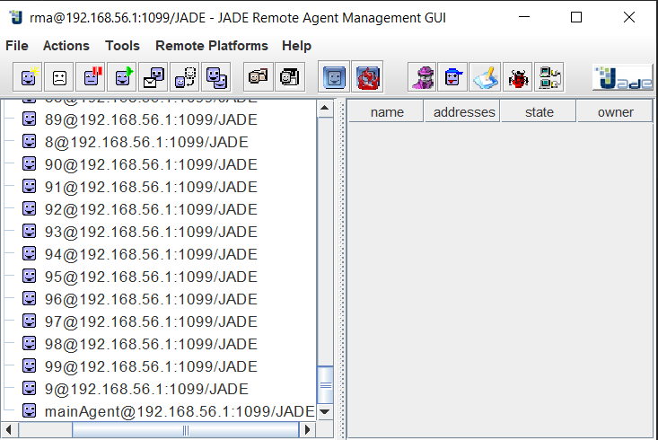
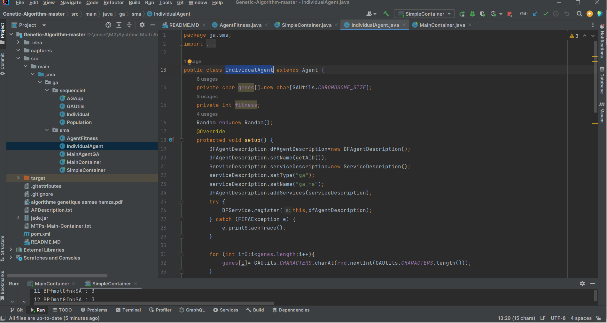
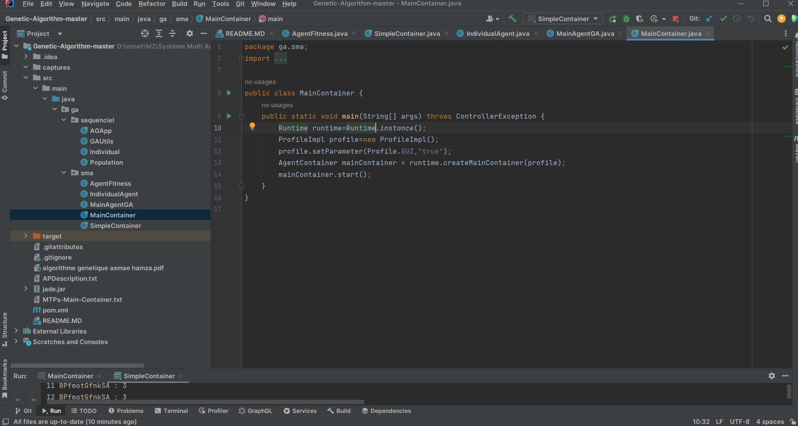
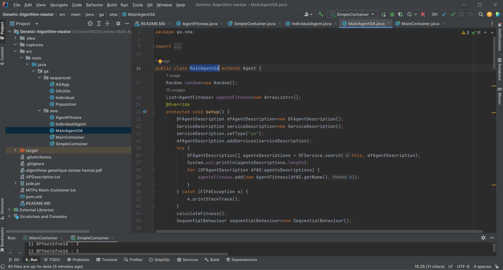
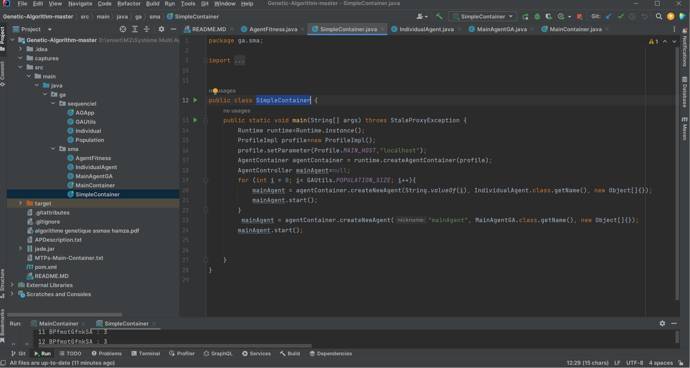
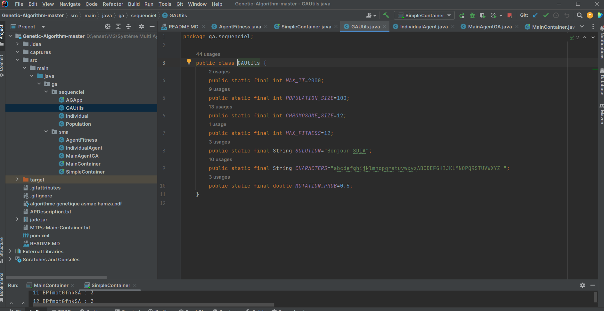
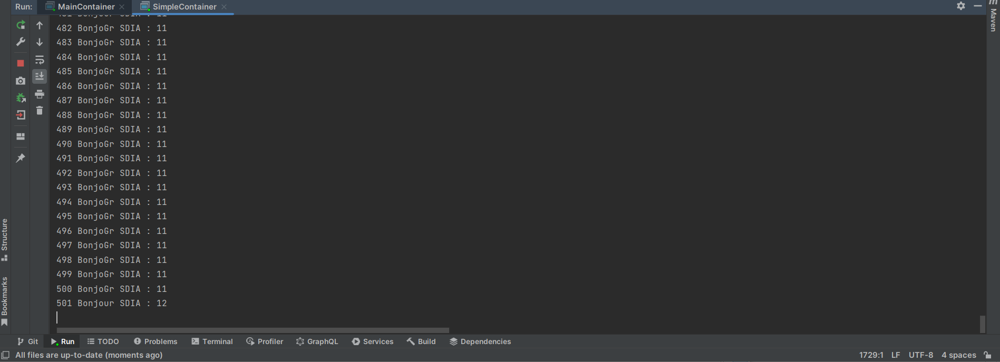

<h3> Genetic Algorithm implementation using Multi-Agent Systems </h3>
<h1>compte rendu</h1> 
<h2> 100 agents </h2> 
 
<h2>IndividualAgent</h2> 
 
<h2>MainContainer</h2> 
 
<h2>MainAgentGA</h2> 
 
<h2>SimpleContainer</h2> 
 
<h2>GAUtils</h2> 
 
<h2>Demonstration</h2> 
 

